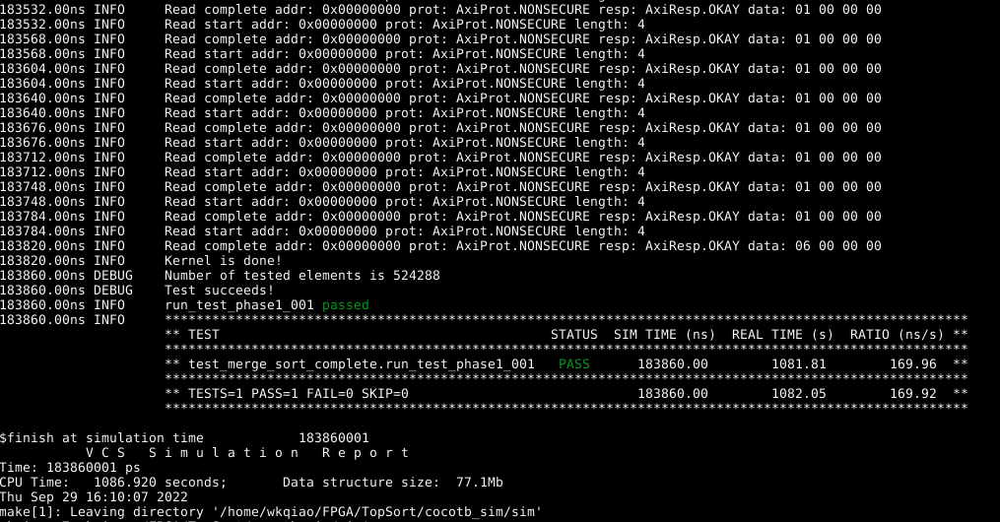

# TopSort
This repository demonstrates TopSort, a high-performance two-phase sorting accelerator optimized for HBM-based FPGA, specifically, Xilinx Alveo U280.

## Prerequisities

This directory is compatible with Vitis 2020.2 or later.

You may need to download the Vitis_Accel github directory from [Xilinx Github](https://github.com/Xilinx/Vitis_Accel_Examples.git). Then copy the TopSort directory into its rtl_kernel folder.


## Project Folder Structure


| **Folder/File** | **Description** |
| --- | --- |
| [benchmark](./benchmark) | This folder contains the random data generator. The generated benchmark will also be here. |
| [cocotb_sim](./cocotb_sim/) | This folder contains the cocotb-based simulation files for fast simulation using Synopsys VCS. |
| [constraints](./constraints) | This folder contains all the configuration and constraints files for HBM channel mapping and PnR process. |
| [scripts](./scripts) | This folder contains the scripts to package the .xo for the kernel |
| [src](./src) | This folder contains the SystemVerilog source code and the host code |
| [Makefile](./Makefile) | Makefile for the project |
| [xrt.ini](./xrt.ini) | Simulation configuration file |

## Testing

### Random data generator

We provide a random data generator in the [benchmark/datagen_key_value.py](./benchmark/datagen_key_value.py), which asks you to put the number of HBM channels you want to use and how many elements to be stored in each channel. 

```bash
cd benchmark
python3 datagen_key_value.py
```

The HBM on U280 contains 32 HBM channels and each channel can store 256 MB, giving a total capacity of 8 GB. Correspondingly, TopSort can sort at most 4 GB data, as it needs to use 16 HBM channels for reading the unsorted data and another 16 HBM channels for writing the unsorted data. For instance, to generate 4 GB random (32-bit key, 32-bit value) pairs, you can specify that there are 16 HBM channels used and each channel contain 32 M key-value pairs.

### Hardware simulation

For hardware emulation, you can specify the input benchmark you want to sort by changing CMD_ARGs in the Makefile. We suggest you using a smaller benchmark for simulation to reduce the simulation time, e.g., each channel contains 2^15 elements.

```bash
CMD_ARGS = $(BUILD_DIR)/merge_sort_complete.xclbin ./benchmark/data_cmpl_kv_1^15_chan_16 15
...
```

To run hardware simulation, please type

```bash
make run TARGET=hw_emu DEVICE=<FPGA platform>
```

### Cocotb simulation

It usually takes long time (e.g., up to one hour) for Xilinx Vitis to compile the design and do the hardware simulation, even if we only change one line of the source code. To reduce the development and simulation time, we also support a much faster [cocotb](https://docs.cocotb.org/en/stable/)-based simulation flow, which uses python as the front end to provide stimulus to the hardware and uses Synopsys VCS as the back end to generate the waveform. 

We can explicitly simulate the two phases of Topsort, respectively. 
1. To simulate the first phase of TopSort: 
We need to add the following line in [Makefile](./cocotb_sim/sim/Makefile):

```bash
COMPILE_ARGS += +define+TEST_PHASE_1
```

We also need to uncomment line 439 in [test_merge_sort_complete.py](./cocotb_sim/sim/test_merge_sort_complete.py):

```bash
#factory = TestFactory(run_test_phase1)
```

After simulation completes, you should see the results as shown below:  

You may also refer to the *merge_sort_complete.vpd* file to see all the dumped signal waveforms.

2. To simulate the second phase of TopSort: 
We need to add the following line in [Makefile](./cocotb_sim/sim/Makefile):

```bash
COMPILE_ARGS += +define+TEST_PHASE_2
```

We also need to uncomment line 440 or line 441 in [test_merge_sort_complete.py](./cocotb_sim/sim/test_merge_sort_complete.py), where *run_test_phase2_uniform* runs the experiment that contains uniformly distributed data and *run_test_phase2_same* runs the experiment that contains data with the same key:

```bash
#factory = TestFactory(run_test_phase2_uniform)
#factory = TestFactory(run_test_phase2_same)
```

### On-board test

First, you need to find the taget platform installed on your serve by typing

```bash
xbutil list
```

Below is an example of available platforms 
```bash
 [0] 0000:af:00.1 xilinx_u250_xdma_201830_2(ID=0x5d14fbe6) user(inst=130)
 [1] 0000:d8:00.1 xilinx_u280_xdma_201920_3(ID=0x5e278820) user(inst=131)
 [2] 0000:5e:00.1 xilinx_u50_gen3x16_xdma_201920_3 user(inst=129)
 [3] 0000:3b:00.1 xilinx_u200_qdma_201920_1(ID=0x5dccb0ca) user(inst=128)
```

If we want to run on the Xilinx u280 platform, then change line 80 in the [host code](./src/host.cpp) to speficy `devices[1]`.

For hardware on-board test, you need to generate the bitstream first using the following command. The default path of the generated bitstream is in folder `./build_dir.hw.<FPGA platform>`.

```bash
make all TARGET=hw DEVICE=<FPGA platform>
```

Then you may be able to run the on-board test as follows.
```bash
./host ./build_dir.hw.<FPGA platform> ./benchmark/data_cmpl_kv_1^20_chan_16 20
```

Note, the bitstreams generated each time may vary from each other in terms of the design frequency even if they have the same configurations, this is because we enable the ```explore``` option in the [PnR implementation](./constraints/pnr.cfg). To achieve the best timing closure, you may need to generate a couple of bitstreams and select the best one. 


## Related Publication
+ Weikang Qiao, Licheng Guo, Zhenman Fang, Mau-Chung Frank Chang, Jason Cong.
  [TopSort: A High-Performance Two-Phase Sorting Accelerator Optimized on HBM-based FPGAs].
  In FCCM, 2022.
  [[PDF]](https://arxiv.org/pdf/2205.07991.pdf)
